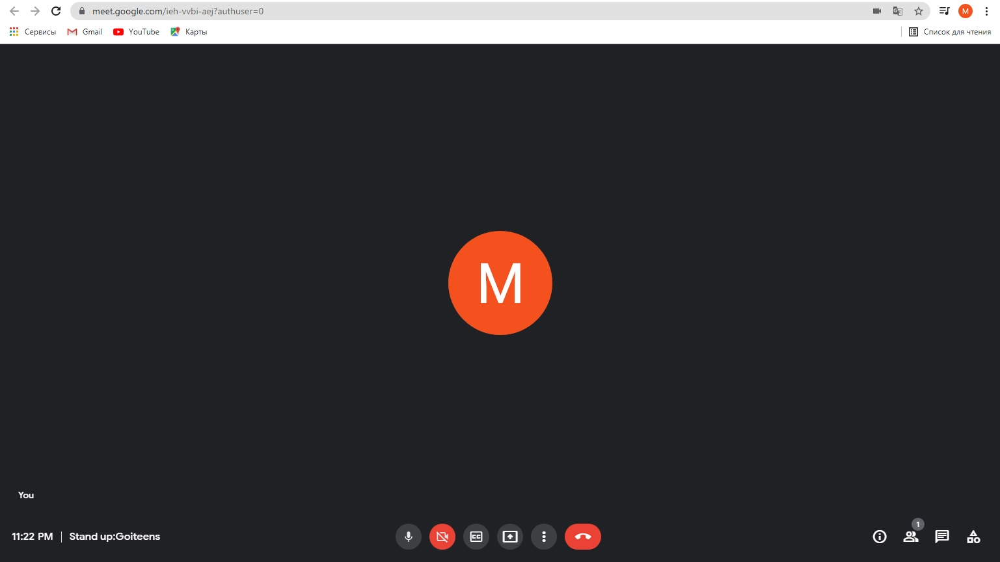
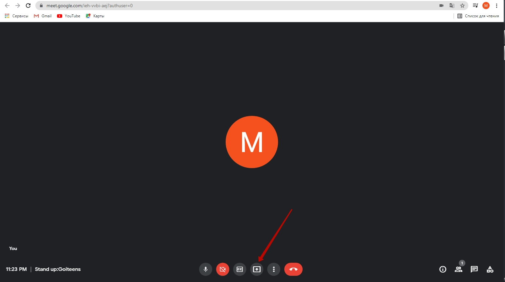
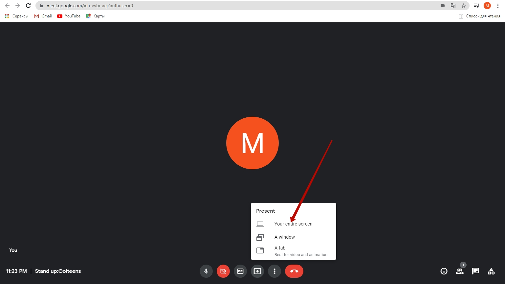
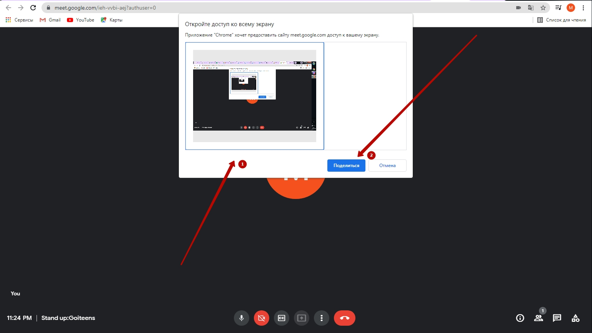
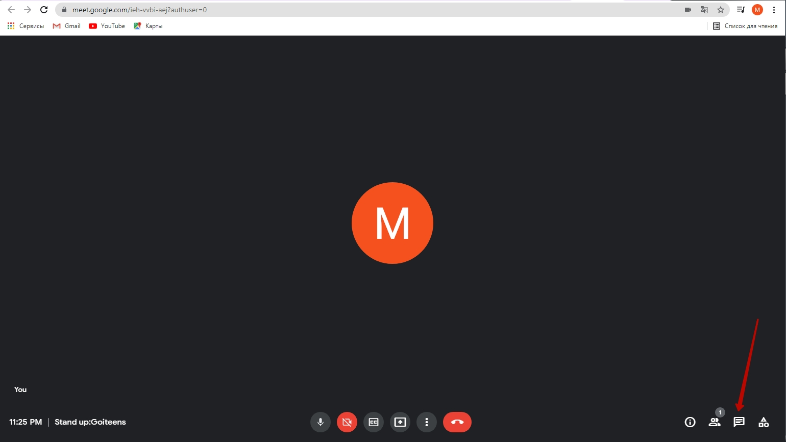
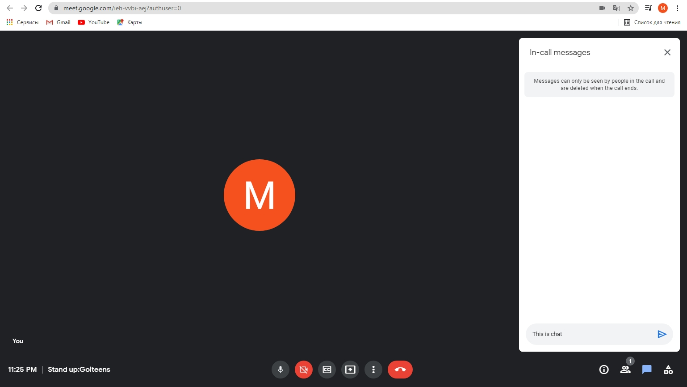
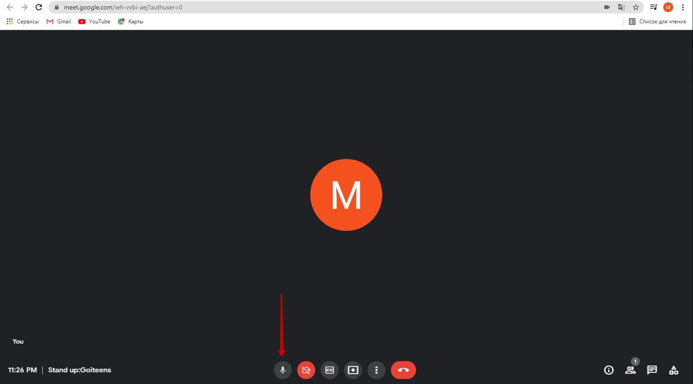

# Основи роботи з google-meet
## Демонстрація екрану.
Дана можливість в Google Meet дозволяє показати власний екран. Це дозволяє викладачу бачити ваш екран та одразу допомагати вам, якщо у вас щось не вдається.
### Основний екран Google Meet
  

### Кнопка демонстрації екрану
  

### Обрання зони, яку будемо деомнструвати
  

### Підтведження обраної зони
  
Натискаємо на картинку по центру та клікаємо на кнопку 

### Кнопка чату
  

### Чат включено
  

### Вимкнення мікрофону
  
